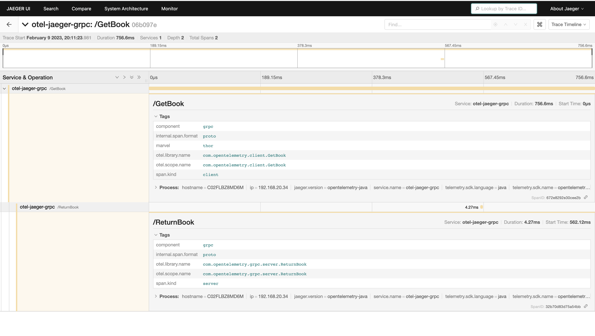
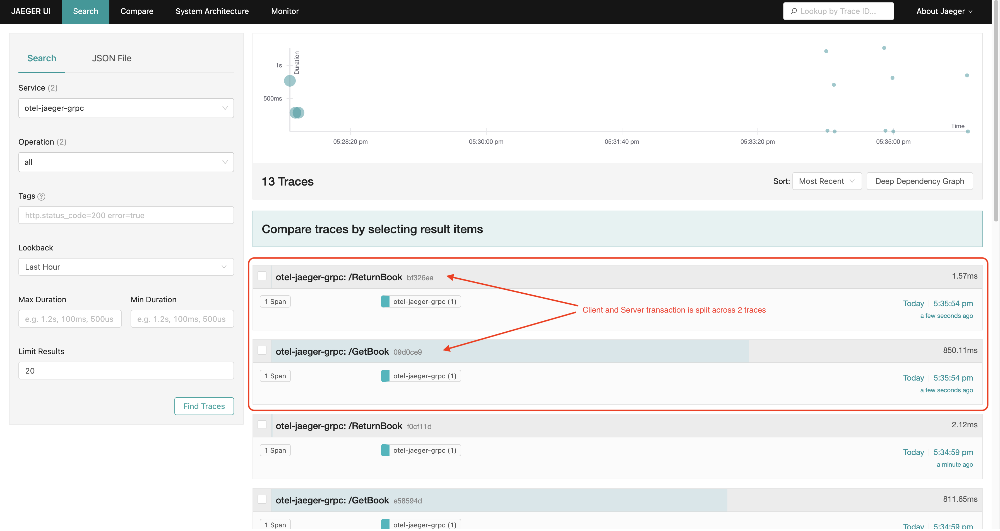
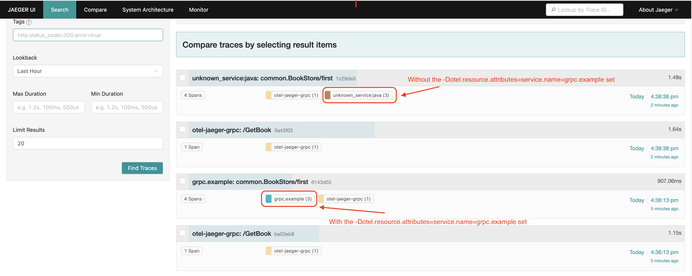
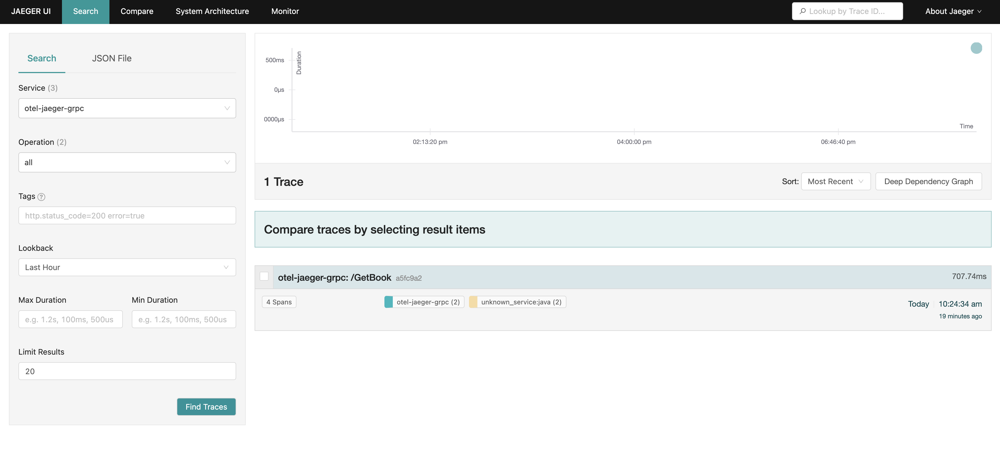
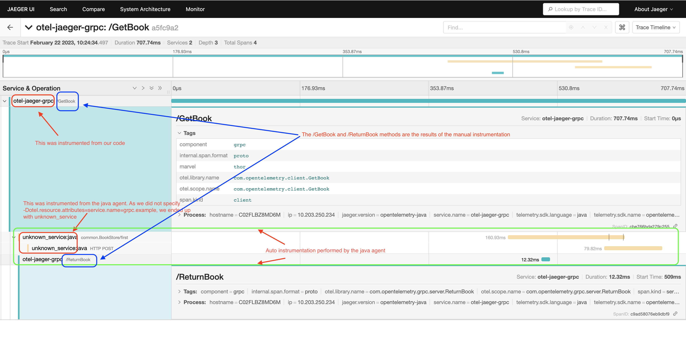

# gRPC Example

**Note:** This is an advanced scenario useful for people that want to *manually* instrument their own code. The examples are extracted and combined from 

[tutorialspoint](https://www.tutorialspoint.com/grpc/grpc_unary.htm)   
[opentelemetry](https://github.com/open-telemetry/opentelemetry-java-docs/blob/main/grpc/README.md)


This example demonstrates the following objectives 
- Getting start with gRPC in Java
- OpenTelemetry API to instrument normal and streamed gRPC calls.

---

## Project Structure

The example consists of 3 modules naming
- 
- grpc-client
- grpc-proto
- grpc-server

The `grpc-proto` module contains all the common proto files and common library (e.g. OtelSdk configuration)

---

## Getting start with gRPC in Java
In the getting start there are 2 examples which is 

### Application 1
- GreetClient
- GreetServer

### Application 2
- BookeStoreServerUnary
- BookStoreClientUnaryBlocking

---

## OpenTelemetry API to Instrument Normal gRPC Calls

In the OpenTelemetry manual instrumentation example, we are using the Unary example in the application.

- `BookStoreClientUnaryBlockingMetadata`
- `BookeStoreServerMetadata`

The example creates the **Root Span** on the client and sends the distributed context over the gRPC request. On the server side, the example shows how to extract the context and create a **Child Span**.

--- 

# How to run

## Prerequisites
* Java 1.8
* Docker


## 1 - Start Jaeger 
```shell script
./docker-compose up
```

## 2 - Compile the application
```shell script
cd grpc-client-server
mvn package
```

## 3 - Start the normal Server

BookStoreServerMetadata
```shell script
java -cp ./grpc-server/target/grpc-server-jar-with-dependencies.jar com.opentelemetry.grpc.BookeStoreServerMetadata
```
BookStoreServerUnary
```shell script
java -cp ./grpc-server/target/grpc-server-jar-with-dependencies.jar com.opentelemetry.grpc.BookeStoreServerUnary
```
GreetServer
```shell script
 java -cp ./grpc-server/target/grpc-server-jar-with-dependencies.jar com.opentelemetry.grpc.GreetServer
```


## 4 - Start the normal Client

BookStoreClientUnaryBlockingMetadata
```shell script
java -cp ./grpc-client/target/grpc-client.jar com.opentelemetry.grpc.BookStoreClientUnaryBlockingMetadata Great
```
BookStoreClientUnaryBlocking
```shell script
java -cp ./grpc-client/target/grpc-client.jar com.opentelemetry.grpc.BookStoreClientUnaryBlocking Great
```
GreetClient
```shell script
java -cp ./grpc-client/target/grpc-client.jar com.opentelemetry.grpc.GreetClient Hello Jarvis
```

--- 

## Jaeger Snapshot



---

### Key Notes (Issues Encountered)   

#### Issue 1 (In Client Module)
The application can be run directly on IntelliJ, however once we package it into shadow jar and execute, the following error appears.

`WARNING: RPC failed: Status{code=UNKNOWN, description=null, cause=java.nio.channels.UnsupportedAddressTypeException`

**Resolution**  
https://stackoverflow.com/questions/73286776/grpc-unsupportedaddresstypeexception-but-only-when-packaged-with-shadowjar

#### Issue 2 (In Client Module - Continuation)
After modifying the `pom.xml` file to include to solution highlighted in issue 1, during package phase the following error appears.

`Cannot find 'resource' in class org.apache.maven.plugins.shade.resource.ServicesResourceTransformer`

**Resolution**  
https://itecnote.com/tecnote/maven-shade-for-parameter-resource-cannot-find-resource-in-class-org-apache-maven-plugins-shade-resource-manifestresourcetransformer/


#### Issue 3 (In Client Module & Server Module)

Initial during package with the default `pom.xml` on both the client and server module, attempting to jar the default jar will encounter the following error.

`Exception in thread "main" java.lang.NoClassDefFoundError: com/opentelemetry/proto/GreeterGrpc`

**Resolution**
Both client and server modules `pom.xml` needs to have their <build> instructions. Apparently the server and the client <build> instructions. If we attempt to use the server module `pom.xml` into the client module, issue 1 and issue 2 will appear.

---

## Starting with Open Telemetry Instrumentation jar

### Observation 1

The transaction is split into 2 separate traces without the context propagating across. 




- To start the server application
```shell script
java -javaagent:./opentelemetry-javaagent.jar -cp ./grpc-server/target/grpc-server-jar-with-dependencies.jar com.opentelemetry.grpc.BookeStoreServerMetadata
```


- To start the client application
```shell script
java -javaagent:./opentelemetry-javaagent.jar -cp ./grpc-client/target/grpc-client.jar com.opentelemetry.grpc.BookStoreClientUnaryBlockingMetadata Great
```


### Observation 2

What if we include the environment variable to the startup command   

`-Dotel.resource.attributes=service.name=grpc.example`    
`-Dotel.traces.exporter=jaeger` 

- To start the server application
```shell script
java -javaagent:./opentelemetry-javaagent.jar -Dotel.resource.attributes=service.name=grpc.example -Dotel.metrics.exporter=logging -Dotel.traces.exporter=jaeger  -cp ./grpc-server/target/grpc-server-jar-with-dependencies.jar com.opentelemetry.grpc.BookeStoreServerMetadata 
```


- To start the client application
```shell script
java -javaagent:./opentelemetry-javaagent.jar  -Dotel.resource.attributes=service.name=grpc.example -Dotel.metrics.exporter=logging=logging -Dotel.traces.exporter=jaeger -cp ./grpc-client/target/grpc-client.jar com.opentelemetry.grpc.BookStoreClientUnaryBlockingMetadata Great
```

The transaction is split into 2 separate traces without the context propagating across. However as expected, with Otel agent added we see more protocol instrumented

### Observation 3

We updated the following environment variable to the startup command

~~-Dotel.resource.attributes=service.name=grpc.example~~
`-Dotel.metrics.exporter=logging=logging`


- To start the server application
```shell script
java -javaagent:./opentelemetry-javaagent.jar -Dotel.metrics.exporter=logging -Dotel.traces.exporter=jaeger  -cp ./grpc-server/target/grpc-server-jar-with-dependencies.jar com.opentelemetry.grpc.BookeStoreServerMetadata
```

- To start the client application
```shell script
java -javaagent:./opentelemetry-javaagent.jar  -Dotel.metrics.exporter=logging=logging -Dotel.traces.exporter=jaeger -cp ./grpc-client/target/grpc-client.jar com.opentelemetry.grpc.BookStoreClientUnaryBlockingMetadata Great
```
This is the output that we should be expecting. Note that we did not change any code but just updated the environment variable to the startup command.


Trace overview


In depth view of the trace